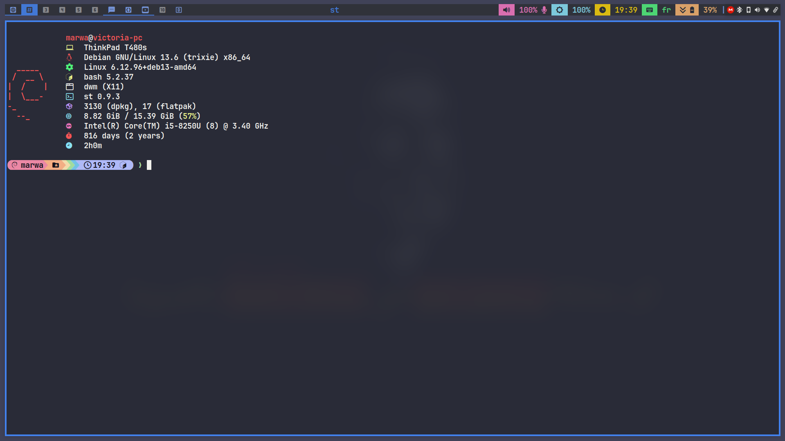
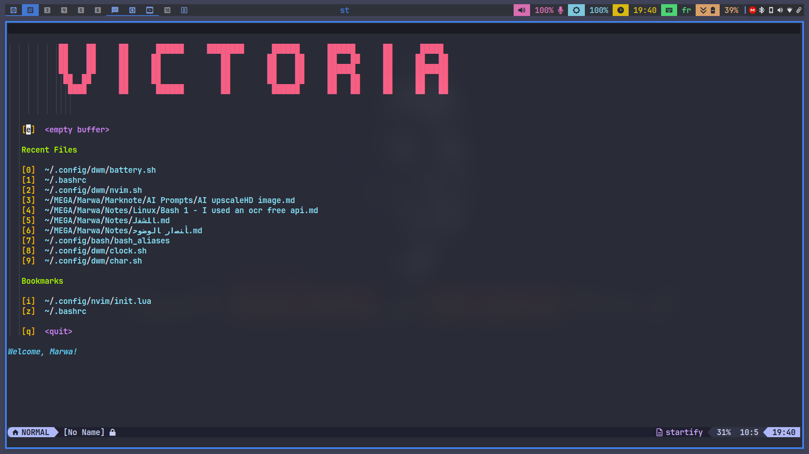
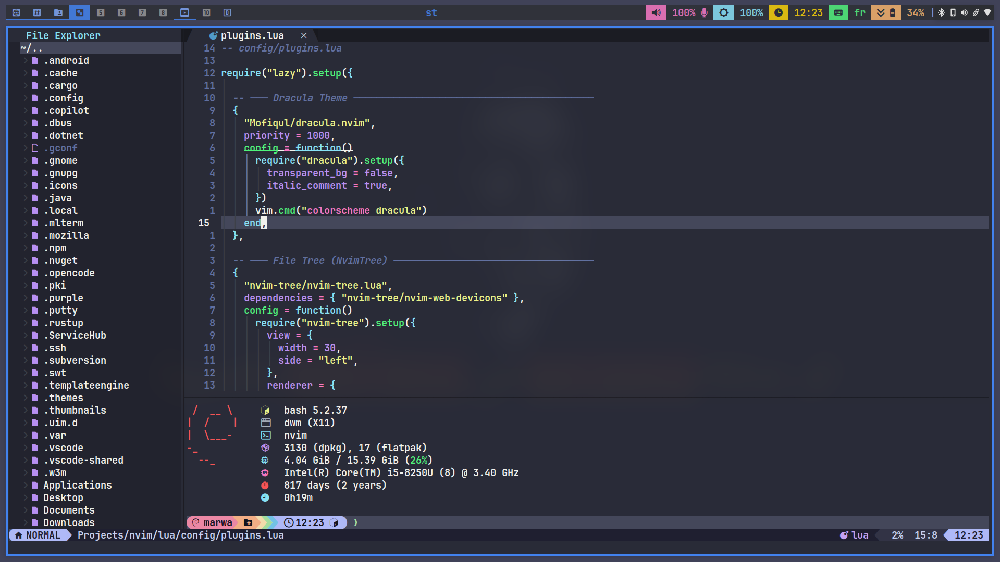
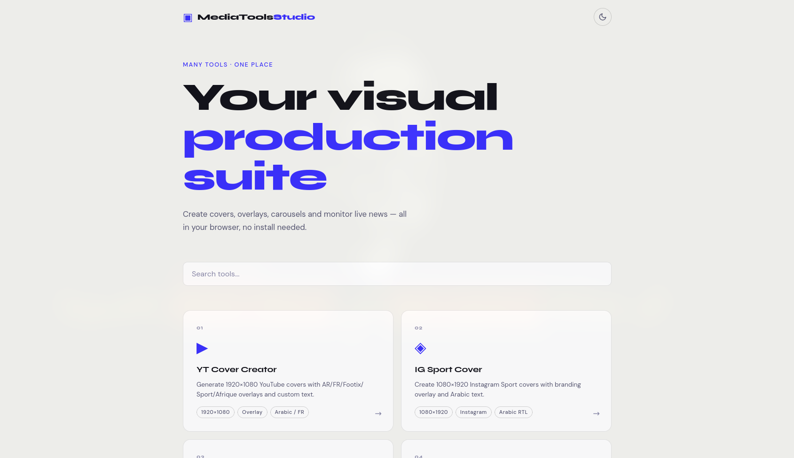

# مرحبا · Hello · Bonjour 👋

# I'm Marwatoo

### *Minimal systems, maximum expression. I like tools that get out of the way — and stories that don't.*

---

### ✍️ About me

I write — in Arabic, English, and French — and I read political essays for fun, usually with a terminal open in the other window. Between that, I code, edit video, design, and put together content for social media. Most of what I build starts from the same instinct: strip away what isn't needed and keep what actually helps.

On the desktop, that means switching between **bspwm**, **dwm**, and **KDE Plasma** depending on the mood, and running patched, minimal builds of the suckless suite. On the creative side, it means replacing bloated software with lighter tools I've built myself when I can.

I daily-drive **Debian** — partly because I love it, partly because (unlike some distro-hoppers out there) I'm mentally stable and feel secure. 😄

A quote I keep coming back to:

**كل مشكلة يستحيل حلها هي مشكلة خاطئة بالضرورة**

*Every problem impossible to solve is necessarily a false problem.*

*Tout problème impossible à résoudre est nécessairement un faux problème.*

**— Mehdi Amel (مهدي عامل)**

---

### 🧰 What I build

I maintain personal, patched builds of the suckless suite — stripped down, fast, and tuned to my own workflow — alongside tools that replace heavier commercial software for everyday creative work.

| Repo | What it is |
|---|---|
| 🪟 [`dwm`](https://github.com/marwatoo/dwm) | My build of the dynamic window manager |
| 🖥️ [`st`](https://github.com/marwatoo/st) | My build of the simple terminal, patched with autocomplete, scrollback, bidi, and more |
| 📊 [`slstatus`](https://github.com/marwatoo/slstatus) | Status bar feeding dwm |
| 🧱 [`dwmblocks`](https://github.com/marwatoo/dwmblocks) | Modular status bar blocks for dwm |
| 🐍 [`PyBrand`](https://github.com/marwatoo/PyBrand) | A PIL-based tool that replaces Photoshop for social media content creation |
| 🛠️ [`cmtools`](https://github.com/marwatoo/cmtools) | A collection of browser-based HTML apps — including a Photoshop-alternative tool and an Arabic note-taking tool |
| 😀 [`Slackmoji`](https://github.com/marwatoo/Slackmoji) | Small script to fix emojis copied from Slack |
| ✒️ [`nvim`](https://github.com/marwatoo/nvim-config) | Personal neovim config |

---

### 🖥️ Desktop

Debian, dwm, and st in daily use
  

Neovim welcome screen
  

Neovim configuration
  

CM Tools — <a href="https://marwatoo.github.io/cmtools/index.html?maro=1">try it live</a> 

---

### ⚙️ Stack

**Languages & frameworks**

**Desktop & tools**

**Design & video**

Notes are kept in **Obsidian** and **KDE MarkNotes**. Conky widgets on the desktop are scripted in **Lua**.

---

### 💬 Favorite quote

### كل مشكلة يستحيل حلها هي مشكلة خاطئة بالضرورة

### *Every problem impossible to solve is necessarily a false problem.*

### *Tout problème impossible à résoudre est nécessairement un faux problème.*

**— Mehdi Amel (مهدي عامل)**

---

### 📖 Currently

> ### Somewhere between a half-finished dotfiles commit and the next essay in the reading queue.

---

### 📫 Reach me

